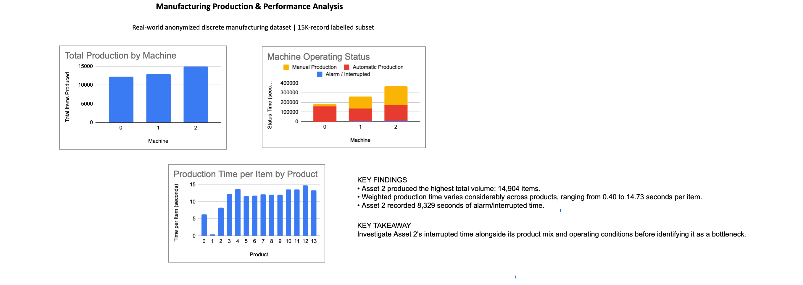

# Manufacturing Production & Performance Analysis

## Overview

This project analyzes real-world anonymized industrial manufacturing data to identify production patterns, machine operating behavior, and product-level performance differences.

The analysis uses a labelled subset of an anonymized discrete manufacturing dataset collected from an industrial environment.

## Business Questions

- Which machines and products have the highest production volumes?
- How is machine operating time distributed across production states?
- How does production time vary across products?
- Which machines or products may require further performance investigation?
- How does product mix affect machine-level performance comparisons?

## Dataset

The dataset is based on the SME Manufacturing Dataset described by Atzeni et al. (2023).

The project uses the labelled subset for Company A, containing approximately 15,000 production records.

The dataset contains information including:

- Timestamp
- Machine / asset
- Items produced
- Machine operating status
- Average power
- Cycle time
- Alarm / interruption information
- Product identifier

## Analysis

The analysis was performed using Google Sheets and includes:

- Machine production analysis
- Product production analysis
- Machine operating status analysis
- Machine performance analysis
- Product performance analysis
- Asset × Product production analysis
- Weighted production time per item
- Dashboard visualizations

### Key Findings

- Asset 2 recorded the highest production volume with 14,904 items.
- Weighted production time varies considerably across products.
- Asset 2 recorded the highest amount of alarm/interrupted time at 8,329 seconds.
- Machine-level performance comparisons are influenced by product mix, as different machines produce different product groups.

### Key Takeaway

Asset 2's interrupted time should be investigated alongside its product mix and operating conditions before identifying it as a bottleneck.

## Dashboard

## Tools

- Google Sheets
- Pivot Tables
- Data Analysis
- Manufacturing / Industrial Engineering concepts

## Limitations

This analysis uses an anonymized labelled subset of the original dataset.

Machine performance should not be interpreted in isolation because machines have different product mixes. Identifying a true production bottleneck would require additional information such as planned production requirements, demand, defects, downtime causes, and process constraints.

## Dataset Reference

Atzeni, D. et al. (2023).  
*Data-Driven Insights through Industrial Retrofitting: An Anonymized Dataset with Machine Learning Use Cases.*

Sensors, 23(13), 6078.

Dataset source:  
https://github.com/HumanCenteredTechnology/SME-Manufacturing-Dataset
